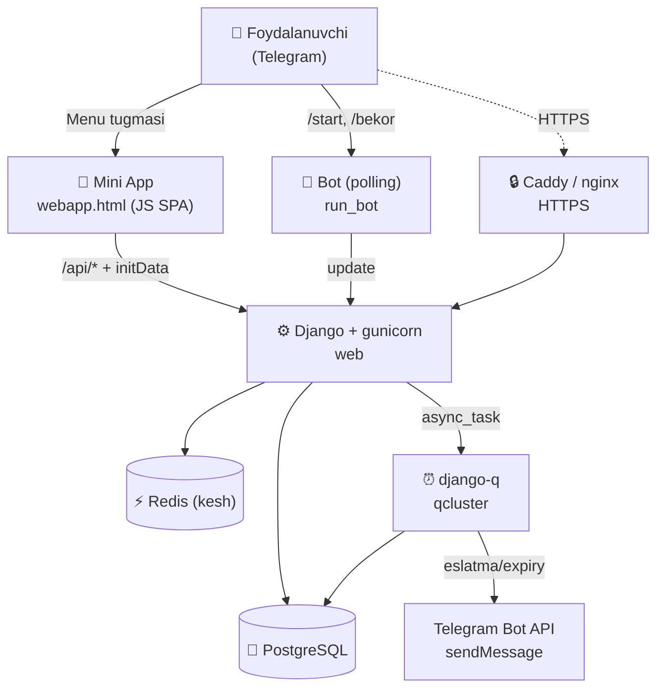

# 💈 BarberShop — Telegram Mini App

Sartaroshxonalar uchun **onlayn bron qilish** platformasi. Telegram bot ichida ochiladigan Mini App (WebApp) ko'rinishida ishlaydi: mijozlar salon tanlaydi, xizmat va usta bo'yicha vaqt band qiladi; sartaroshlar o'z kabineti, xizmatlari va salonini boshqaradi.

> Telegram orqali autentifikatsiya — parol va ro'yxatdan o'tish shart emas. Mijoz Telegram akkaunti orqali tanilaydi.

---

## ✨ Asosiy imkoniyatlar

**Mijoz uchun**
- 🏪 Salonlar ro'yxati (ishonch balli bo'yicha saralangan) va batafsil sahifa
- 🔍 **Qidiruv** — salon/usta nomi yoki **telefon** bo'yicha
- 🗺️ **Xaritada ko'rish** — barcha salonlar bitta xaritada; **«Yaqinimda»** — joylashuv bo'yicha masofa bilan
- ⚡ **Dynamic Availability** — bir nechta xizmat tanlash; tizim jami davomiylik/narxni hisoblaydi va faqat **mos keladigan** bo'sh vaqtlarni ko'rsatadi
- 📅 Bron oqimi: xizmat(lar) → usta → sana → bo'sh vaqt → telefon → tasdiqlash
- ⭐ **Baho va sharh** — bron bajarilgach 5 yulduzli baho + izoh
- 🚩 **Shikoyat** — nomaqbul salon ustidan (sabab bilan)
- 🔔 Eslatmalar: navbatдан **5 daqiqa**, **1 soat**, **24 soat** oldin
- 🧾 «Bronlarim» — kelayotgan/o'tgan bronlar, bekor qilish
- 📞 Salon telefoni — bir bosishda **qo'ng'iroq** yoki **nusxalash**

**Sartarosh / salon egasi uchun**
- 🧑‍💼 Kabinet: bugungi/kelayotgan bronlar, statistika, profil holati
- ✅ **Telefon tasdig'i** (Telegram kontakt) — profil ko'rinishi uchun shart
- ✂️ Xizmatlar, bronlash qabuli, profil tahrirlash
- 🏬 Salon boshqaruvi: nomi, shahar, manzil, logo, muqova, **joylashuv (xarita)**, **ijtimoiy tarmoqlar** (Instagram/Telegram/TikTok/Facebook/YouTube) — tahrir yoki **o'chirish**
- 🙋 Boshqa sartaroshlarning **qo'shilish so'rovlari**ni qabul/rad qilish
- 🧍 **Mustaqil (solo)** yoki **salonda** ishlash

**Ishonch va nazorat (moderatsiya)**
- 🔐 **Ko'rinish darvozasi**: salon faqat *tasdiqlangan telefon + ≥1 xizmat + bloklanmagan* bo'lsa omma oldida ko'rinadi — chala/soxta profillar avtomatik yashirin
- 📊 **Ishonch balli** (Bayesian reyting) — yaxshi baholilar avtomatik yuqoriga
- 🚫 **Avto-yashirish**: 3 ta shikoyatда salon avtomatik yashiriladi
- 🛠️ **Django admin**: shikoyatlar navbati, salon to'xtatish/tiklash, foydalanuvchini bloklash

**Bron hayot-sikli**
- Holatlar: `pending → confirmed / cancelled / completed / no_show / expired`
- ⏳ Vaqti o'tgan bronlar avtomatik **«Bajarildi»** bo'ladi (baho berish uchun)
- 🚫 Mijoz istalgan paytda **qo'lda bekor qila** oladi (WebApp yoki bot `/bekor`)

**Dizayn**
- 🎨 Apple «Clean Light» — monoxrom, minimalist, `Inter` shrift
- 🌗 Light/Dark rejim (foydalanuvchi tanlaydi)
- 📱 Mobil-birinchi (Telegram Mini App)

---

## 🧰 Texnologiyalar

| Qatlam | Texnologiya |
|---|---|
| Backend | **Django 5.1** (Python 3.12) |
| Ma'lumotlar bazasi | **PostgreSQL 16** |
| Kesh | **Redis 7** (django-redis) |
| Fon vazifalari | **django-q2** (ORM broker — Celery EMAS) |
| Telegram bot | **python-telegram-bot 21** (polling rejimi) |
| Xarita | **Leaflet + OpenStreetMap** (bepul, API kalitsiz) |
| Frontend | Vanilla JS SPA (bitta `webapp.html`, inline CSS) |
| Web server | **gunicorn** + **whitenoise** |
| Reverse-proxy / TLS | **Caddy** (avtomatik HTTPS) yoki nginx + certbot |
| Konteynerlar | **Docker + Docker Compose** |

---

## 🏗️ Arxitektura

Ilova Telegram bot orqali ochiladi. Mini App (HTML/JS) Django'ning JSON API'siga **Telegram initData** (imzolangan foydalanuvchi ma'lumoti) bilan murojaat qiladi. Bot alohida **polling** jarayonида ishlaydi, fon vazifalari **django-q** orqali bajariladi.



**Autentifikatsiya:** har bir `/api/*` so'rovi Telegram `initData` imzosini `TELEGRAM_BOT_TOKEN` bilan tekshiradi (`webapp_api` dekoratori). `DEBUG=True` va token bo'lmaganда — lokal test uchun avtomatik «dev» foydalanuvchi biriktiriladi.

**Muhim:** ilova **Telegram ичida** ishlashга mo'ljallangan. Brauzerда to'g'ridan ochilса `Unauthorized` beradi — bu normal (Telegram identifikatsiyasi yo'q).

---

## 📁 Loyiha tuzilishi

```
BarberShop/
├── apps/
│   ├── accounts/        # User (rollar: client / barber / owner)
│   ├── shops/           # Shop, BarberProfile, WorkingHours, ShopJoinRequest
│   ├── services/        # Service, ServiceCategory
│   ├── bookings/        # Appointment, BlockedSlot + slot mantiqi
│   ├── notifications/   # Telegram/SMS yuborgichlar + eslatma tasklari
│   ├── telegram_bot/    # WebApp view, bot handlerlari, JSON API, set_webhook/run_bot
│   ├── portfolio/       # Telegram kanaldan portfolio sinxronlash
│   └── core/            # Baza modellar, setup_periodic_tasks komandasi
├── config/
│   ├── settings/        # base.py, dev.py, prod.py
│   ├── urls.py, wsgi.py, asgi.py
├── templates/telegram/webapp.html   # Butun Mini App (JS SPA + inline CSS)
├── static/ · media/
├── docker/              # entrypoint.sh, Caddyfile
├── nginx/               # host nginx vhost (shared-server deploy uchun)
├── requirements/        # base.txt, prod.txt
├── Dockerfile · docker-compose.yml · docker-compose.prod.yml
└── manage.py
```

---

## 🚀 Ishga tushirish

### 1) Lokal (development)

**Talablar:** Python 3.12, PostgreSQL, (ixtiyoriy) Redis.

```bash
# Virtual muhit + kutubxonalar
python3.12 -m venv venv && source venv/bin/activate
pip install -r requirements/base.txt

# Muhit sozlamalari
cp .env.example .env        # DB_*, SECRET_KEY ni to'ldiring; DEBUG=True

# Baza va davriy vazifalar
export DJANGO_SETTINGS_MODULE=config.settings.dev
python manage.py migrate
python manage.py setup_periodic_tasks
python manage.py createsuperuser

# Ishga tushirish (uchta alohida terminalда)
python manage.py runserver 8000     # web
python manage.py qcluster           # fon vazifalari (eslatma/expiry)
python manage.py run_bot            # Telegram bot (token bo'lsa)
```

- Admin panel: `http://localhost:8000/admin/`
- `DEBUG=True` va token bo'sh bo'lsa, Mini App'ni brauzerда ham sinash mumkin (dev bypass).

### 2) Production (Docker — bir komanda)

**Talablar:** Docker + Docker Compose; domen serverga qaratilган; 80/443 ochiq; Telegram bot tokeni.

```bash
cp .env.prod.example .env      # SECRET_KEY, DB_PASSWORD, TELEGRAM_BOT_TOKEN ... to'ldiring
docker compose up -d --build
```

Bitta komanda ko'taradi: **PostgreSQL · Redis · web (gunicorn) · qcluster · bot · Caddy**. Birinchi ishga tushishда migratsiya, statik fayllar, superuser va HTTPS sertifikat **avtomatik** sozlanadi (Caddy — Let's Encrypt).

BotFather → **Bot Settings → Menu Button** → URL: sizning domeningiz (`https://…/`).

> **Umumiy (shared) serverда** — agar serverда boshqa saytlar host nginx orqали ishlayotgan bo'lsa — Caddy o'rniga `docker-compose.prod.yml` (web'ni `127.0.0.1:8081` da) + host nginx vhost (`nginx/`) + certbot ishlatiladi. Batafsil: [`DEPLOY.md`](DEPLOY.md).

---

## ⚙️ Muhit o'zgaruvchilari (`.env`)

| O'zgaruvchi | Tavsif |
|---|---|
| `SECRET_KEY` | Django maxfiy kaliti (uzun, tasodifiy) |
| `DEBUG` | `True` (dev) / `False` (prod) |
| `ALLOWED_HOSTS` | Domen(lar), vergul bilan |
| `CSRF_TRUSTED_ORIGINS` | `https://domen` — POST so'rovlar uchun (prod) |
| `DB_NAME/USER/PASSWORD/HOST/PORT` | PostgreSQL |
| `REDIS_URL` | Kesh uchun Redis manzili |
| `TELEGRAM_BOT_TOKEN` | @BotFather tokeni (bot + initData tekshiruvi) |
| `TELEGRAM_WEBAPP_URL` | Mini App manzili (`https://domen/`) |
| `ESKIZ_EMAIL/PASSWORD` | SMS fallback (ixtiyoriy) |

To'liq namuna: [`.env.example`](.env.example) (dev) va [`.env.prod.example`](.env.prod.example) (prod).

---

## ⏰ Fon vazifalari (django-q)

`setup_periodic_tasks` quyidagi jadvallarni o'rnatadi:

| Vazifa | Davr | Ish |
|---|---|---|
| `send_5min_reminders` | har 1 daqiqa | Navbatdan 5 daq oldin eslatma |
| `expire_appointments` | har 5 daqiqa | Vaqti o'tgan bronlarni yopish |
| `send_upcoming_reminders` | har 5 daqiqa | 1 soatlik eslatma |
| `send_day_before_reminders` | har soat | 24 soatlik eslatma |

> Eslatmalar ishlashi uchun **`qcluster`** doim ishlab turishi va `TELEGRAM_BOT_TOKEN` to'ldirilган bo'lishi shart.

---

## 🧪 Testlar

Kritik biznes-mantiq (slot generatsiyasi, overlap, bron yaratish, ko'rinish
darvozasi, ishonch balli) avtomatik testlar bilan qoplangan. Django'ning o'z
test framework'i — qo'shimcha bog'liqlik yo'q.

```bash
DJANGO_SETTINGS_MODULE=config.settings.test python manage.py test
```

- Sozlama: `config/settings/test.py` (Redis/token/cluster'siz, tez).
- Obyekt yaratuvchilar: `apps/core/test_utils.py`.
- **CI:** `.github/workflows/ci.yml` — har push/PR da PostgreSQL bilan testlarни
  va migratsiya sinxronligини (`makemigrations --check`) tekshiradi.

---

## 🛠️ Foydali komandalar

```bash
python manage.py set_webhook            # webhook rejimiga o'tsangiz
python manage.py run_bot                # polling rejimida bot
python manage.py setup_periodic_tasks   # davriy vazifalarni (qayta) o'rnatish

# Docker (prod)
docker compose logs -f web              # loglar
docker compose logs -f bot              # bot loglari
docker compose exec web python manage.py createsuperuser
docker compose up -d --build            # yangilangach qayta deploy
```

---

## 📄 Litsenziya

Xususiy loyiha. Barcha huquqlar mualliflarга tegishli.
